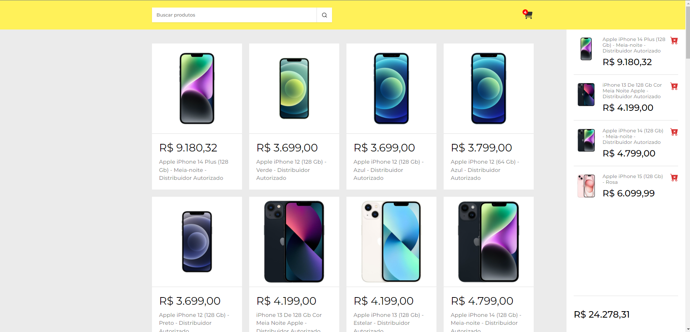

<h1 align="center">
  Carrinho de compra
</h1>

 
    

  <a href="#-tecnologias">Tecnologias</a>&nbsp;&nbsp;&nbsp;|&nbsp;&nbsp;&nbsp;
  <a href="#-projeto">Projeto</a>&nbsp;&nbsp;&nbsp;|&nbsp;&nbsp;&nbsp;
  <a href="#-funcionalidades">Funcionalidades</a>&nbsp;&nbsp;&nbsp;&nbsp;

  
  

  

 

## 🚀 Tecnologias
Este projeto foi desenvolvido com as seguintes tecnologias:

- HTML
- CSS
- JavaScript
- React JS

## 🚧 Projeto

 Este projeto  de um carrinho de compras desenvolvido com JavaScript e React JS, por meio da barra de pesquisa permite listar produtos na tela consumindo a API do mercado livre, adicionar e remover produtos do carrinho.

Live Preview: https://carrinho-compra-kappa.vercel.app/

## Funcionalidades
- Listagem de produtos: exibe uma lista de produtos obtidos da API do Mercado Livre.
- Busca de produtos:  pesquisar produtos com base em palavras-chave, consumindo a API do Mercado Livre para obter os resultados.
- Adição de produtos ao carrinho: adicionar produtos ao carrinho de compras.
- Remoção de produtos do carrinho: remover produtos do carrinho de compras.

  
##  Inspiração:

YouTube: https://www.youtube.com/@ManualdoDev/videos

---

Feito com ♥ by RossoniPablo
